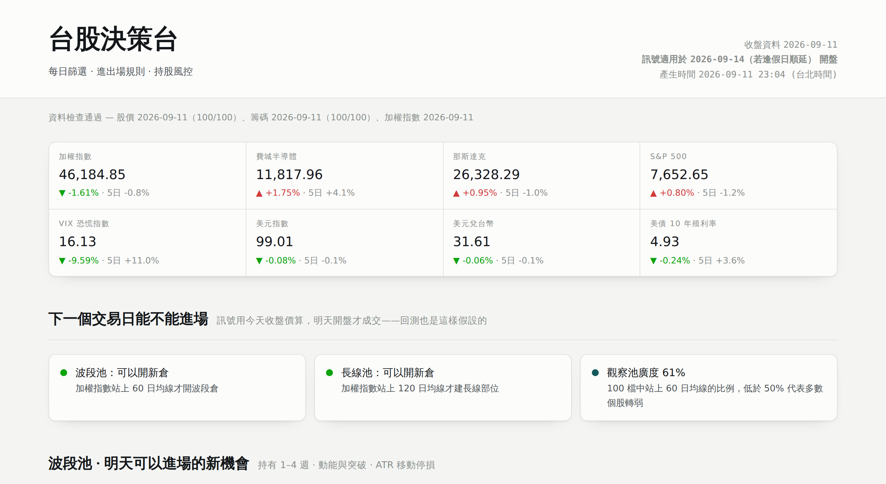
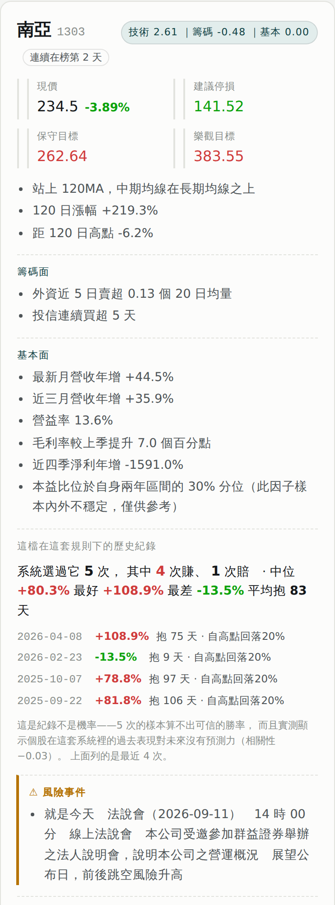

# 台股每日選股與風控系統

每天產生一份台股決策報告：篩選候選標的、給出停損與目標價區間、追蹤既有持股是否該出場，
並把大盤環境納入「今天能不能開新倉」的判斷。輸出是一頁互動式儀表板。

**但這個專案真正的產出不是那份名單，是驗證。**



<table>
<tr>
<td width="42%"></td>
<td valign="top">

**左邊這張卡是整個專案的縮影。**

它給出進場價、停損、兩段目標價，然後——

- 列出這檔在這套規則下的**每一次歷史紀錄**（5 次、4 賺 1 賠、中位 +80.3%）
- 緊接著自己補一句：**「這是紀錄不是機率——5 次的樣本算不出可信的勝率，而且實測顯示個股在這套系統裡的過去表現對未來沒有預測力（相關性 −0.03）」**
- 標出當天的**風險事件**（法說會就是今天，前後跳空風險升高）
- 新聞分利多／利空，但額外標「事實」還是「觀點」，並在下面寫為什麼那則觀點的資訊量很低


</td>
</tr>
</table>

我用十年、1,088 檔上市股票的日線資料，證明了自己這套規則**風險調整後打不贏買進持有**，
並且逐一記錄了 14 個「聽起來很合理、實測沒用」的想法。其中兩組是我自己提出、
又被自己的數據推翻的：**五個進場品質因子**（事先把預期方向寫進程式碼，五個全失敗、四個符號相反）
與**絕對成交值下限**（我提出來補救觀察池問題的方案，三個門檻實測全都更差）。
選股系統很容易做得好看，難的是知道它到底有沒有用。

---

## 十年回測：主要結果

Point-in-time 觀察池（每月依當時成交值重排前 100）、純技術面、
含手續費 0.1425%×2 + 證交稅 0.3% + 滑價 0.1%×2。訊號在 T 日收盤產生，T+1 開盤成交。

期間 **2017-05-02 ~ 2026-08-31**（PIT 池需要 150 根 K 才起算，所以比資料起點晚半年）：

| | 總報酬 | 年化 | 最大回撤 | Sharpe | 勝率 |
|---|---|---|---|---|---|
| **本策略** | +374.7% | +18.2% | **−49.9%** | **0.74** | 37.3%（609 筆） |
| 加權指數 | +364.0% | — | −31.6% | — | — |
| 等權重買進持有（911 檔） | +370.7% | — | −33.8% | 1.01 | — |

**總報酬三者幾乎打平，但我多付了 18 個百分點的回撤去換。** Sharpe 0.74 對 1.01——
風險調整後是輸的。逐年只有 **4/10 年**贏過大盤，而且**十年裡有 2,161 天（95%）處在水面下**。

一個帶停損的趨勢策略跑十年，結果是「報酬打平、波動更大」，那它就沒有存在價值。
這是這個專案最重要的一個數字。

### 唯一真正的價值：空頭

| 年份 | 策略 | 大盤 | 差 |
|---|---|---|---|
| 2018 | −24.7% | −8.6% | −16.1 |
| **2022** | **−6.9%** | **−22.4%** | **+15.5** |
| 2023 | +89.2% | +26.8% | +62.4 |
| 2024 | +5.6% | +28.5% | −22.9 |

2022 是唯一一次強制風控真的發揮作用的年份。其餘年份它主要在做的事是「在多頭裡被洗出場」。

### 分盤勢表現

用「距一年高點回檔 + 指數在不在 120MA 之上 + 20 日已實現波動百分位」把每天分成四類：

| 盤勢 | 交易日 | 筆數 | 勝率 | 平均報酬 | 中位 |
|---|---|---|---|---|---|
| 多頭暴漲 | 588 | 184 | 48.4% | **+10.29%** | −0.71% |
| 箱型盤整 | 1,240 | 354 | 34.2% | +2.22% | −3.45% |
| 空頭暴跌 | 277 | 37 | 18.9% | −10.83% | −10.66% |
| 陰跌磨盤 | 167 | 34 | 29.4% | −0.39% | −3.32% |

**錢幾乎只從「多頭暴漲」那 26% 的日子賺到。** 其餘 74% 的時間在原地打轉或失血。
注意每一類的**中位數都是負的**——獲利集中在極少數幾筆。

---

## 基準率：這套設定歷史上到底會發生什麼

把十年裡所有符合進場條件的候選，全部丟進真實的出場規則模擬一遍。
兩個關鍵的資料處理（第一版都做錯過）：

- **資料截斷**：持有上限 250 天但資料只剩 2 年時，強制平倉的那筆不能當成正常結果。長線池勝率因此從 57.0% → 52.5%
- **重疊事件**：同一段趨勢會連續幾十天都符合條件，算成幾十筆等於把一次結果重複計數。用 5 天間隔把連續候選收斂成一個事件後，13,651 列 → 493 個獨立事件，勝率 52.5% → **42.6%**、中位數 +2.04% → **−2.37%**

| | 獨立事件 | 勝率 | 中位數 | 平均 | 平均持有 | 賺 >20% |
|---|---|---|---|---|---|---|
| 波段池 | 854 | 39.9% ±3.3 | **−2.49%** | +7.04% | 16.0 天 | 15.2% |
| 長線池 | 493 | 42.6% ±4.4 | **−2.37%** | +23.60% | 42.9 天 | 29.4% |

**兩池的中位數都是負的。** 系統推薦的標的，一半以上會賠錢；正期望值完全來自右尾那幾筆。
這句話直接寫在儀表板上每一檔標的旁邊。

---

## 被資料否決的想法（14 條）

這是我認為這個專案最值得看的一節。每一條都是先有假設、先預註冊預期方向，再測、再記錄。

### 因子類

| 想法 | 為什麼合理 | 實測 | 判定 |
|---|---|---|---|
| 量能倍數 | 放量突破 | 樣本內 IC 0.088（十個因子最強）→ 樣本外 **0.007** | 剔除 |
| 成交量異常 z 分數 | 「熱度」的可回測代理 | 30 檔時 0.023 → 106 檔 **0.001** | 剔除 |
| 當沖比率 | 投機熱度 | OOS IC 0.051 不錯，但加進策略報酬 228.7% → **148.9%**；而且 1 日持有期為負、20 日才轉正 | 剔除 |
| 自營商 5 日買超比 | 法人動向 | IS 0.076 / OOS **−0.036**，符號反轉 | 剔除 |
| 投信 5 日買超比 | 同上 | IS 0.043 / OOS **−0.010** | 剔除 |
| 現金殖利率 | 價值面 | 30 檔 −0.088、106 檔 −0.071，兩次都負 | 剔除 |
| 營益率 / 毛利率 | 獲利品質 | 30 檔 OOS 0.081 → 106 檔 **0.011**，低於 0.02 門檻 | 剔除 |

### 規則類

| 想法 | 實測 | 判定 |
|---|---|---|
| 外資賣超否決 | 樣本外報酬 97.3% → 73.9%，回撤變差 | 停用 |
| 營收衰退否決 | 樣本外報酬 97.3% → 69.8% | 停用 |
| 掉出榜單就賣 | 波段池平均報酬 **+4.95% → −0.05%**，賺 >20% 的比例 **14.1% → 0.5%** | 從未採用 |
| 觀察池只進不出 | 十年 374.7% → **269.0%**，六項指標全輸，逐年 8/10 落後 | 不採用 |
| 絕對成交值下限 | **我自己提的補救方案。** 0.5/1/3 億三個門檻全部**比不設門檻更差**，而且沒有劑量反應 | 自我推翻 |

### 最反直覺的一條：基本面

月營收年增率是整套系統裡 IC 最高、最穩定的因子（樣本內 0.104 / 樣本外 0.105，
遠高於籌碼面的 0.05 級距）。但只要把它加進評分，全期間報酬就從 **228.7% 掉到 158.7%**、
最大回撤從 −18.7% 惡化到 −23.6%，四種權重配置都一樣。

解釋：IC 衡量的是**整個橫斷面**的排序能力，但這套策略只取前 5 名。
在最極端的那一端，技術面與籌碼面已經選出強勢股，再疊加營收成長會把名單推向
「基本面已經反映在股價上、漲多回檔風險高」的那一側。**高 IC 不等於在尾端有用。**

所以基本面留在卡片上給人看，但 `FUNDAMENTALS["enabled"] = False`，不進排序。

### 五個進場品質因子：全軍覆沒

想做一個「0~100 進場推薦分數」，設計了五個因子，並且**事先把預期方向寫進程式碼**
（`entry_quality.EXPECTED_SIGN`），這樣假設錯了才看得出來：

| 因子 | 預期 | 結果 |
|---|---|---|
| 偏離 20MA 程度 | − | 失敗 |
| 停損距離與 ATR 的匹配度 | + | **符號相反** |
| 距 60 日高點 | + | **符號相反** |
| 量能衰退 | − | **符號相反** |
| 近 5 日漲停次數 | − | **符號相反** |

五個全部失敗，其中四個在兩個期間**都是相反方向**。把任一個裝成硬性閘門重跑回測，
報酬從 231.7% 一路掉到最低 78.7%。**我沒有事後把符號翻過來**——那樣做就只是在對雜訊過擬合。

順帶量到一件更根本的事：現有的綜合評分，在候選池內部與實際結果的**等級相關幾乎是零**
（樣本內 −0.025 / 樣本外 −0.003）。**除了最後 20% 以外，排名順序是雜訊。**

---

## 觀察池：從固定名單到 point-in-time

最早是手挑 30 檔，後來擴成「近三個月日均成交值前 100 大 + 原有 6 檔」共 106 檔。

**這 106 檔有選擇偏誤**：用 2026 年的成交值挑股票，再拿去回測 2016~2026，
等於拿答案回去考試。當年是雞蛋水餃股、後來變大型股的全在池子裡；
當年是權值股、後來衰退的全被排除。

現在改成每月最後一個交易日依近 60 日日均成交值重排前 100（`src/universe_live.py`），
再聯集手上的持股（持股不因掉出排名而停止追蹤）。十年下來會用到 450 檔不同的股票。
**重點是 dashboard 與回測現在用同一套池子建構方式**——否則回測數字根本不在描述線上系統的行為。

規則對照（十年 PIT 回測）：

| 觀察池規則 | 總報酬 | 回撤 | Sharpe | 勝率 |
|---|---|---|---|---|
| 每月前 100（會剔除） | **+374.7%** | −49.9% | 0.74 | 37.3% |
| 累積只進不出 | +269.0% | −53.4% | 0.67 | 35.4% |
| 累積 + 下限 1 億 | +223.2% | −51.0% | 0.63 | 37.5% |

但 bootstrap 顯示**單筆交易的平均報酬差異信賴區間跨 0**（[−2.49%, +4.54%]），
統計上分不出好壞；支持前者的是「逐年 8/10 落後」而不是那個 105pp 的總報酬差。
這個區別很重要，寫在這裡免得自己之後誤讀。

---

## 採用中的因子（106 檔橫斷面重新校準）

只留樣本內外 IC **同號**且樣本外 > 0.02 的。權重刻意壓小，籌碼是加分項不是主角。

| 籌碼因子 | 樣本內 IC | 樣本外 IC | 權重 |
|---|---|---|---|
| 三大法人 20 日買超比 | 0.023 | 0.066 | 0.6 |
| 外資 5 日買超比 | 0.048 | 0.052 | 0.5 |
| 外資連買天數 | 0.048 | 0.043 | 0.4 |
| 券資比 | 0.034 | 0.040 | 0.3 |
| 投信連買天數 | 0.028 | 0.022 | 0.2 |

加總上限 1.5。**不做任何否決規則**——兩條都試過，樣本外都讓報酬變差。

---

## 策略規則

**波段池（1–4 週）**
- 進場：收盤 > 20MA 且 20MA > 60MA、距 60 日高點 5% 內、5 日均量 > 60 日均量 ×1.15、RSI14 < 80、20 日動能為正
- 排序：動能 z 分數 + 逼近前高程度 + 量能放大 − 波動度，再加籌碼分
- 出場：連兩日跌破 20MA｜2.5×ATR 移動停損｜−8% 硬停損｜持有滿 **60** 個交易日

**長線池（數月）**
- 進場：收盤 > 120MA、60MA > 120MA、120 日動能為正、距 120 日高點回檔 < 15%
- 出場：跌破 120MA｜自波段高點回落 20%

**大盤濾網**：加權指數站上 60MA 才開波段倉、站上 120MA 才建長線部位。

**目標價是參考值，不是出場條件**——`swing_exit()` 裡沒有任何目標價判斷，
回測的報酬全部來自移動停損。這點容易誤會，所以特別寫明。

---

## 架構

```
使用者電腦（Windows）                    雲端容器
├ daily_update.py  抓資料               ├ src/refresh.py  重算
│  Yahoo 還原股價                        │  verify_data → chart_data
│  證交所 OpenAPI（法人/融券/重訊/處置）    │  → signals → dashboard
│  STOCK_DAY_ALL（全市場成交值）           └ Artifact 發布（固定網址）
└ universe_live.py  每月重排觀察池
```

| 檔案 | 做什麼 |
|---|---|
| `src/config.py` | 所有可調參數 + 決策紀錄（被剔除的因子留在註解裡） |
| `src/universe_live.py` | **每月重排觀察池**，輸出 `data/universe_current.json` |
| `src/universe_pit.py` | 回測用的 point-in-time 池（含 `cumulative` / `floor` 模式） |
| `src/indicators.py` | 均線、RSI、ATR、動能、量能比、還原股價處理 |
| `src/strategy.py` | 進場條件、排序分數、兩種出場規則 |
| `src/backtest.py` | 事件式回測引擎，T 日訊號 → T+1 開盤成交 |
| `src/run_backtest.py` | 兩年回測（含籌碼面） |
| `src/run_long.py` | **十年 PIT 回測 + 分盤勢報告** |
| `src/walkforward.py` | 參數逐年穩定性檢定 |
| `src/compare_universe.py` | **觀察池規則對照 + 流動性分組 + bootstrap** |
| `src/base_rates.py` | 基準率（含重疊事件收斂與資料截斷處理） |
| `src/entry_quality.py` | 進場品質因子（預註冊預期方向，五個全失敗） |
| `src/validate_entry_score.py` | 進場分數的 IS/OOS IC 檢定 |
| `src/test_entry_gate.py` | 把因子裝成硬閘門重跑回測 |
| `src/chips.py` / `src/fundamentals.py` | 籌碼／基本面因子與 IC 檢定 |
| `src/events.py` | 處置股、注意股、現金增資、重大訊息、法說會 |
| `src/news.py` | 新聞旗標（只顯示不計分） |
| `src/signals.py` | 產生當日報告 JSON |
| `src/dashboard.py` | 組成單檔 HTML 儀表板 |
| `src/verify_data.py` | 資料完整性檢查（新進股票有 45 天寬限期） |
| `src/refresh.py` | 一行跑完整條管線 |
| `src/trades.py` | 實單紀錄（含「有沒有照規則走」的標記） |

---

## 新聞與事件：刻意不計分

**新聞這一層無法回測**——沒有免費的歷史新聞情緒資料庫，證不了它有沒有用，所以不讓它影響排序。

而且它有方向固定的**選擇偏誤**：觀察池是用成交值挑的（都是漲上來的股票），
財經媒體對漲的股票寫的就是多頭稿。所以新聞旗標會系統性地確認技術面已經說過的話，
看起來像獨立的第二意見，實際上是同一個訊號的回音。
（有一次系統完全漏掉某檔的重大利空，就是這個原因——後來改成從證交所**重大訊息**端點抓，
那是法定揭露，好壞都得公告。）

事件行事曆則是「別在錯的時間點進場」的提醒：處置股（分盤撮合，**停損不一定砍得掉**）、
注意股、現金增資、法說會、除權息、財報公告期限。

---

## 已知限制

1. **殘留存活偏誤修不掉**：已下市／被合併的公司沒有可靠歷史，資料裡股票數從 910（2016）成長到 1,088（2026），成長全部來自新上市，沒有任何一檔「消失」。所有回測數字仍然偏高。
2. 十年回測只有技術面。1,088 檔 × 10 年拿不到籌碼與基本面資料，所以那個 374.7% 不能直接跟兩年版的 228.7% 比。
3. `max_hold_days = 60` 是看了樣本外結果才定的，該區間的數字不是乾淨的樣本外（詳見上面）。
4. 籌碼因子的樣本外只有一年、一種市場環境，IC 0.03~0.05 是很弱的訊號。
5. 回測用收盤價判斷、隔日開盤成交，與實際盤中停損會有差異。處置期間分盤撮合，停損可能根本執行不了。
6. 新聞旗標未經事實查核。
7. **這不是投資建議。**

---

## 執行方式

```bash
python3 src/refresh.py              # 一行跑完：檢查 → 訊號 → 圖表 → 儀表板
python3 src/universe_live.py        # 重排觀察池（基準日沒變就自動不動）
python3 src/run_backtest.py         # 兩年回測（含籌碼面）
python3 src/run_long.py             # 十年 PIT 回測 + 分盤勢
python3 src/walkforward.py          # 參數逐年穩定性
python3 src/compare_universe.py     # 觀察池規則對照
python3 src/base_rates.py           # 重算基準率
```

每日自動更新的流程見 `RUNBOOK.md`。
